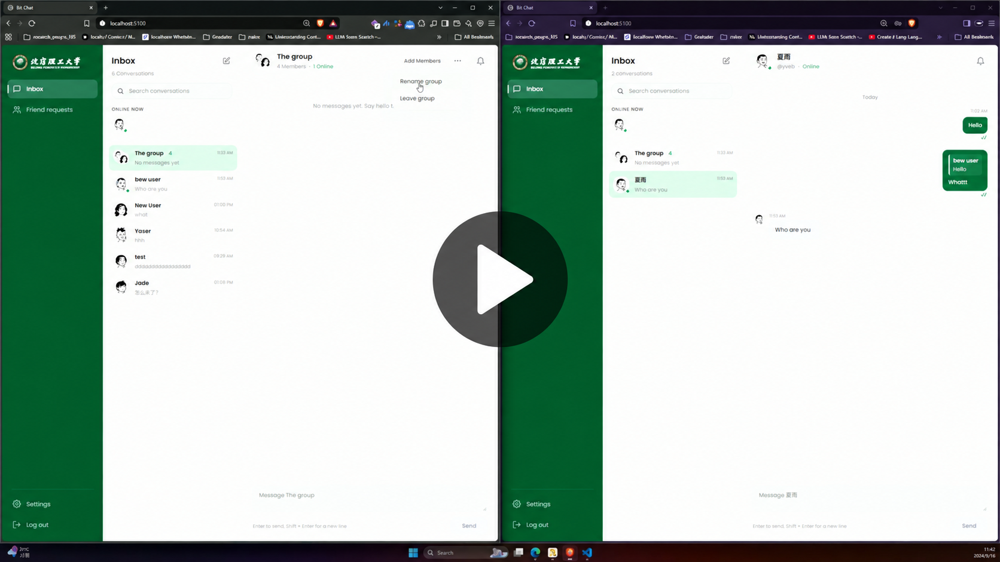

# Bit-chat

Bit-chat is a web-based instant messaging app for direct and group conversations. It pairs a React interface with an Express API, MongoDB storage, and Socket.IO updates so messages, conversation activity, and online status appear without a page refresh.

## Demo

[](docs/media/bit-chat-demo.mp4)

## Features

- **Accounts and sessions:** sign up, sign in, and sign out with username/password authentication and an HTTP-only session cookie.
- **Friends:** discover users, send and accept friend requests, decline or withdraw requests, and remove friends.
- **Direct and group conversations:** start chats with friends, rename groups, add members, and leave groups.
- **Live messaging:** send text messages and replies, see typing indicators and read receipts, and track unread messages across conversations.
- **Persistent history:** load older messages with cursor-based pagination. Messages support up to 4,000 characters.
- **Presence:** see who is online, including users connected through multiple tabs.
- **Responsive interface:** use the inbox, friends list, notifications, and account details on desktop or smaller screens.

The client uses the real API; running the interface alone does not provide a working chat session.

## Technology


| Layer                         | Technologies                                              |
| ------------------------------- | ----------------------------------------------------------- |
| Client                        | React 19, Vite 7, CSS, Socket.IO client                   |
| Server                        | Node.js, TypeScript, Express 5, Socket.IO 4               |
| Database                      | MongoDB with Mongoose                                     |
| Authentication and validation | Passport JWT, HTTP-only cookies, bcrypt, Zod              |
| Development                   | Node.js test runner, ESLint, Prettier, Husky, lint-staged |

## Getting started

### Prerequisites

- Node.js **22.22.1 or newer** and npm. This baseline covers the repository's development tooling, including lint-staged.
- A running MongoDB instance, either local or hosted, and its connection URI.
- Git, if cloning the repository and using its commit hooks.

Run the following commands from the repository root unless a step says otherwise.

### 1. Install dependencies

The root, client, and server have separate package files and lockfiles; there is no npm workspace or root application runner.

```sh
npm ci
npm --prefix server ci
npm --prefix client ci
```

The root installation sets up Husky. The pre-commit hook runs lint-staged from the server directory.

### 2. Configure the environment

Copy `server/.env_example` to `server/.env` and `client/.env.example` to `client/.env`. In PowerShell:

```powershell
Copy-Item server/.env_example server/.env
Copy-Item client/.env.example client/.env
```

On macOS or Linux:

```sh
cp server/.env_example server/.env
cp client/.env.example client/.env
```

Skip copying any file you have already configured. Replace the server template's empty values and `PORT=0000` with working settings:

```dotenv
# server/.env
NODE_ENV=development
PORT=8000
MONGODB_URI=mongodb://127.0.0.1:27017/bit-chat
JWT_SECRET=replace-with-a-long-random-secret
CLIENT_ORIGIN=http://localhost:5100
```

Generate a secret with Node.js and use the output as `JWT_SECRET`:

```sh
node -e "console.log(require('node:crypto').randomBytes(32).toString('hex'))"
```

Configure the client to use the server origin, without an `/api` suffix:

```dotenv
# client/.env
VITE_API_URL=http://localhost:8000
```


| Variable        | Location | Purpose                                                                               |
| ----------------- | ---------- | --------------------------------------------------------------------------------------- |
| `NODE_ENV`      | Server   | Defaults to`development`; `production` enables secure cookies with `SameSite=None`.   |
| `PORT`          | Server   | HTTP and Socket.IO port; defaults to`8000` when unset.                                |
| `MONGODB_URI`   | Server   | Required MongoDB connection URI.                                                      |
| `JWT_SECRET`    | Server   | Required secret used to sign and verify session tokens.                               |
| `CLIENT_ORIGIN` | Server   | Allowed browser origin for credentialed requests; defaults to`http://localhost:5100`. |
| `VITE_API_URL`  | Client   | Base origin for HTTP and Socket.IO; defaults to`http://localhost:8000`.               |

Keep credentials in local environment files. Values prefixed with `VITE_` are included in the browser build, so they must not contain secrets.

### 3. Start the app

Make sure MongoDB is reachable, then start the server in one terminal:

```sh
npm --prefix server run dev
```

Start the client in another terminal:

```sh
npm --prefix client run dev
```

Open [http://localhost:5100](http://localhost:5100). Vite uses a strict port, so startup fails if port `5100` is already occupied. The server listens on port `8000` after connecting to MongoDB.

Check [http://localhost:8000/health](http://localhost:8000/health) for:

```json
{ "message": "healthy server", "status": "OK" }
```

### 4. Try a conversation

1. Create an account, then create a second account in another browser or a private window. Normal tabs share the same session cookie.
2. Find the other user in Friends, send a request, and accept it from the second account.
3. Start a direct conversation and send messages from both accounts. Check live delivery, typing indicators, read receipts, and sidebar updates.
4. To try a group, create a third account and establish friendships with the group creator. A new group requires at least two other members.
5. Leave the group from one account and verify that it no longer receives the group's messages.

Friendship is required to start a direct conversation and to send direct messages. Users creating a group or adding members must be friends with the people they invite.

## Development commands


| Task                                | Command from the repository root       |
| ------------------------------------- | ---------------------------------------- |
| Run client tests                    | `npm --prefix client test`             |
| Run server tests                    | `npm --prefix server test`             |
| Check server types, including tests | `npm --prefix server run typecheck`    |
| Lint the server                     | `npm --prefix server run lint`         |
| Check server formatting             | `npm --prefix server run format:check` |
| Fix server lint issues              | `npm --prefix server run lint:fix`     |
| Format server files                 | `npm --prefix server run format`       |
| Build the client                    | `npm --prefix client run build`        |
| Build the server                    | `npm --prefix server run build`        |

Both test suites use Node.js's built-in test runner. Server tests use database stubs; socket tests start local HTTP/Socket.IO servers. They do not require a running MongoDB instance. These tests do not replace checking the complete application against a real database in two browser sessions.

## Production build

Build both packages:

```sh
npm --prefix client run build
npm --prefix server run build
```

Serve `client/dist/` with a static host and run the compiled API with:

```sh
npm --prefix server start
```

The API does not serve the client build. Set `VITE_API_URL` to the public API origin **before building the client**, and set the server's `CLIENT_ORIGIN` to the exact public frontend origin. Configure `MONGODB_URI`, `JWT_SECRET`, `PORT`, and `NODE_ENV=production` in the server environment. Production session cookies require HTTPS. The API host or reverse proxy must support Socket.IO connections.

For a local preview of the built frontend:

```sh
npm --prefix client run preview -- --port 5100 --strictPort
```

Stop the development frontend first so the preview can use the same allowed origin. The API and database must still be running.

## How it works

The client uses HTTP under `/api` for durable operations such as authentication, friendships, conversations, and messages. Socket.IO distributes live changes and carries temporary typing state. Both transports authenticate with the same seven-day `accessToken` cookie.

MongoDB stores users, friendships, conversations, and messages. The server assigns socket rooms from stored conversation membership, so a user receives updates for all their conversations while viewing one. Membership changes update room access, and reconnecting clients refresh their conversation data.

Presence and socket room coordination live in a single server process. Running multiple API instances would require shared presence tracking and a Socket.IO adapter.

## Repository structure

```text
.
├── client/
│   ├── src/
│   │   ├── api/           HTTP API wrappers
│   │   ├── auth/          Session state
│   │   ├── components/    Shared interface components
│   │   ├── data/          Conversation state helpers
│   │   ├── pages/         Authentication, inbox, friends, and settings
│   │   ├── socket/        Socket.IO lifecycle and event handling
│   │   └── styles/        Shared styles and responsive rules
│   └── tests/             Client API, validation, and state tests
├── docs/                  API reference, system design, and interface notes
│   └── media/             Demo video and thumbnail
├── server/
│   ├── src/
│   │   ├── config/        Environment, database, and authentication setup
│   │   ├── controllers/   HTTP request handlers
│   │   ├── lib/           Socket.IO and presence
│   │   ├── middlewares/   Async and error handling
│   │   ├── models/        Mongoose schemas
│   │   ├── routes/        API routes
│   │   ├── services/      Application logic and database operations
│   │   └── validators/    Request validation
│   └── tests/             Service, controller, membership, and socket tests
└── package.json           Repository-level Git hook tooling
```

## Documentation

- [System design](docs/system_design.md)
- [Interface design](docs/design.md)
- [Authentication and sessions](docs/auth.md)
- [User discovery](docs/users.md)
- [Friends and requests](docs/friends.md)
- [Conversations and membership](docs/conversations.md)
- [Messages and history](docs/messages.md)
- [Socket.IO events and client/server protocol](docs/protocol.md)

## Troubleshooting


| Symptom                                                   | What to check                                                                                                                                                      |
| ----------------------------------------------------------- | -------------------------------------------------------------------------------------------------------------------------------------------------------------------- |
| Server fails to start                                     | Confirm`MONGODB_URI` and `JWT_SECRET` are set, MongoDB is reachable, and `PORT` is `8000` rather than the template's `0000`.                                       |
| Frontend cannot reach the API                             | Check`VITE_API_URL`, start the API, and restart Vite after changing client environment variables.                                                                  |
| Sign-in does not persist or requests are rejected by CORS | Match`CLIENT_ORIGIN` to the frontend URL exactly. Use `localhost` consistently for both browser origins during development rather than mixing it with `127.0.0.1`. |
| Client reports that port`5100` is in use                  | Stop the other process, or change the Vite port and server's`CLIENT_ORIGIN` together.                                                                              |
| A direct message is refused                               | Confirm the friend request has been accepted and the friendship still exists.                                                                                      |
| Production authentication fails                           | Check HTTPS, credentialed requests, allowed origin, and browser restrictions on third-party cookies if the frontend and API are on different sites.                |

## Scope

Bit-chat currently focuses on text messaging. Voice/video calls, file attachments, end-to-end encryption, cross-conversation message search, federation, and native mobile applications are outside its current scope. The Settings screen displays account details and supports sign-out; profile editing is not implemented.
